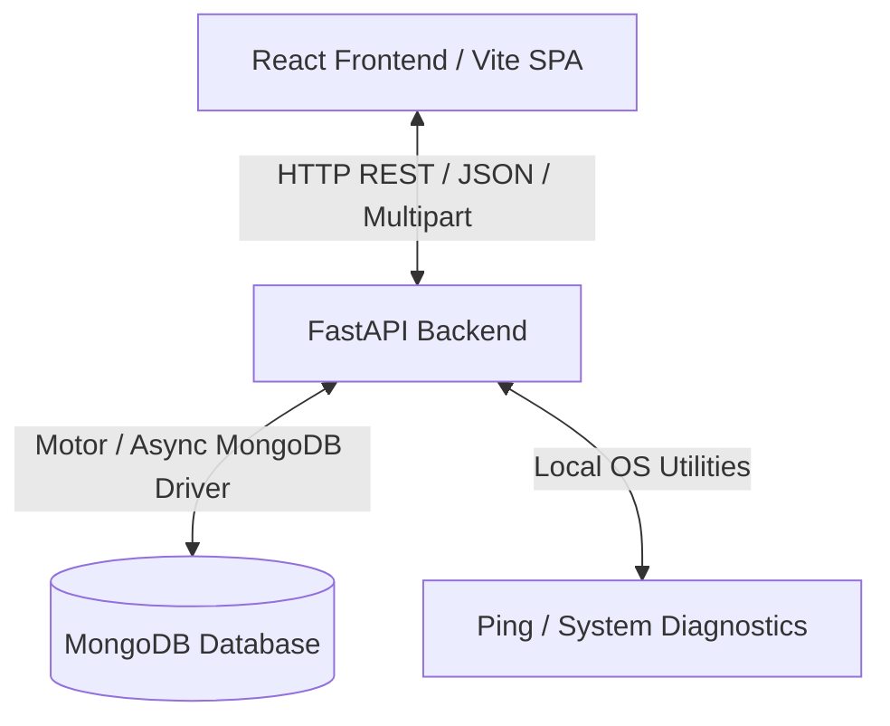

# DCM (Data Center Manager) - Technical Onboarding Guide

Welcome to the **Data Center Manager (DCM)** project! This document serves as a comprehensive technical guide to help new developers get familiar with the codebase, understand its architecture, and follow existing implementation patterns.

---

## 1. System Architecture & Tech Stack

DCM is structured as a decoupled web application with a **FastAPI** backend, a **MongoDB** database, and a **Vite + React** single-page application (SPA) frontend.



### Backend Tech Stack
*   **Language & Runtime:** Python 3.11
*   **Web Framework:** FastAPI (v0.136.1)
*   **ASGI Server:** Uvicorn (v0.47.0)
*   **Database Client:** Motor (v3.7.1) / PyMongo (v4.17.0) - *Async driver for MongoDB*
*   **Data Validation:** Pydantic v2 (v2.13.4)
*   **Authentication:** PyJWT (v2.12.1) + Bcrypt (v5.0.0) + Passlib (v1.7.4)
*   **Excel Parsing:** OpenPyXL (v3.1.5)

### Frontend Tech Stack
*   **Runtime Framework:** React 19 (v19.2.6)
*   **Build Tool & Dev Server:** Vite 8 (v8.0.12)
*   **Language:** TypeScript 6 (v6.0.2)
*   **State Management:** Redux Toolkit (v2.12.0) + React Redux (v9.3.0)
*   **Styling System:** Sass/SCSS Modules (v1.99.0) + Material UI 9 (v9.0.1)
*   **HTTP Client:** Axios (v1.16.1)
*   **PDF Generation:** `html2pdf.js` (v0.14.0) + `jspdf` (v4.2.1)
*   **Animations:** Framer Motion (v12.38.0)

---

## 2. Repository Code Directory Structure

```
DCM/
├── Backend/                    # FastAPI Backend Source
│   ├── Dockerfile              # Production Backend Build Config
│   ├── .dockerignore           # Excludes files from docker context
│   ├── requirements.txt        # Python dependency manifest
│   ├── main.py                 # Application initialization & middleware
│   ├── database.py             # MongoDB connection configuration
│   ├── models.py               # Pydantic schemas (Shared across routers)
│   ├── auth.py                 # Login, session, token generation logic
│   ├── auth_utils.py           # Authentication dependencies & privilege decorators
│   ├── notification_helper.py  # Utility for publishing page/action updates
│   ├── notification.py         # Real-time notification endpoint and router
│   ├── roasters.py             # Roster / Duty shifts management
│   ├── works.py                # Work ticketing and tasks (department-scoped)
│   ├── observations.py         # Incident/Observation logs
│   ├── uploads/                # Local uploads (PDFs, comments attachments)
│   └── logs/                   # Log output files
│
├── frontend/                   # React Frontend Source
│   ├── package.json            # NPM dependencies & build scripts
│   ├── tsconfig.json           # TypeScript compilation config
│   ├── vite.config.ts          # Vite build pipeline setup
│   ├── src/
│   │   ├── main.tsx            # React SPA Entry Point
│   │   ├── store.ts            # Redux central store configuration
│   │   ├── services/
│   │   │   └── request.ts      # Axios wrapper with automatic token injection
│   │   ├── components/         # Reusable UI components (Modal, Table, etc.)
│   │   ├── Layout/             # Sidebar, Header, Sidebar Navigation items
│   │   ├── helpers/            # Date utilities, privilege maps, auth helpers
│   │   └── pages/              # Module Pages
│   │       ├── Attendance/     # Biometric verification simulation
│   │       ├── Work/           # Work ticket grid, comments, create forms
│   │       ├── Observations/   # Incident log tabs (Categories, list)
│   │       ├── Users/          # Staff account cards, details form
│   │       └── BMSChecklist/   # Checklist pages (Daily morning, BMS, Cluster)
```

---

## 3. Core Coding Patterns & Workflows

### Pattern A: Schema Modification (Adding a database field)
When extending a feature (e.g. adding `actionsTaken` to Observations), follow this standard path:

1.  **Backend Model (`Backend/models.py`)**: Update the relevant Pydantic schemas (`Model`, `CreateModel`, `UpdateModel`). Always set a default value or wrap with `Optional` to prevent errors with older MongoDB documents:
    ```python
    class ObservationModel(BaseModel):
        # ... existing fields ...
        actionsTaken: Optional[str] = ""
    ```
2.  **Frontend Interface (`frontend/src/pages/<Module>/model.ts`)**: Add the field definition to TypeScript's data type declarations.
3.  **Initial States (`<Module>List.tsx` / `<Module>FormModal.tsx`)**: Update default/initial values, handlers, and visual display elements.

### Pattern B: API Privilege & Authorization Enforcement
Authorization is strictly checked at both levels:

*   **Backend (`Backend/auth_utils.py`)**:
    FastAPI endpoints use a dependency-injection pattern:
    ```python
    @router.post("/", dependencies=[Depends(require_privilege("Create Observation"))])
    async def create_observation(...):
        # ... endpoint logic ...
    ```
*   **Frontend Routing & Sidebar (`frontend/src/helpers/authUtils.ts`)**:
    We hide actions, pages, and menus based on the current user's privileges:
    ```tsx
    const hasCreatePriv = isSuperuser || privileges?.includes('Create Observation');
    ```

> [!IMPORTANT]
> **Late Login / Restricted Token Constraint:**
> If a user checks in late (attendance blocks full access), the authentication router issues a **restricted JWT token**. This token contains *only* the daily checklist privileges. On the frontend, the Layout detect this restricted status and hides all navigation sidebars except for the checklists page.

### Pattern C: Department-Scoped Work/Task Visibility
To comply with data privacy policies, standard users with the privilege `View All Work` (such as `VIEW_ALL_WORKS` in `works.py`) are only allowed to see works where either the creator or assignee belongs to their **own department**. 
Superusers (`is_superuser: true`) override this constraint to see works globally across the entire organization.

---

## 4. Run/Build Guide

### Running Locally (Development Mode)

#### 1. Running the Database
Ensure you have a MongoDB instance running locally on port `27017` (configured inside `docker-compose.yml` or your local server).

#### 2. Running Backend (Python)
1.  Navigate to `/Backend`
2.  Create virtual environment and install packages:
    ```bash
    python3 -m venv env
    source env/bin/activate
    pip install -r requirements.txt
    ```
3.  Run the server:
    ```bash
    uvicorn main:app --reload --port 8000
    ```

#### 3. Running Frontend (React)
1.  Navigate to `/frontend`
2.  Install packages:
    ```bash
    npm install
    ```
3.  Run dev server:
    ```bash
    npm run dev
    ```

---

## 5. Offline / Intranet Deployment Workflow

For air-gapped intranet environments (where Docker Hub or PyPI cannot be reached), deployment must be built on an internet-enabled machine and transported via archive tarballs:

### Step 1: Build the Image on Development Machine (Online)
Build the image locally:
```bash
docker compose build backend
```
*(The backend build leverages `.dockerignore` to ignore local system environments `env/`, upload folders `uploads/`, and backup logs to keep the image file size to a minimum of ~190MB)*

### Step 2: Export Image to Tarball
Save the compiled image to a disk archive:
```bash
docker save -o dcm-backend.tar dcm_backend:latest
```

### Step 3: Copy & Load on Intranet Machine (Offline)
Copy `dcm-backend.tar` to the target machine and load it:
```bash
docker load -i dcm-backend.tar
```

### Step 4: Start Containers
Start the platform using:
```bash
docker compose up -d
```
No internet lookup will occur; Docker will mount named volumes (e.g., `mongodb_data` and `backend_uploads`) and run successfully.
